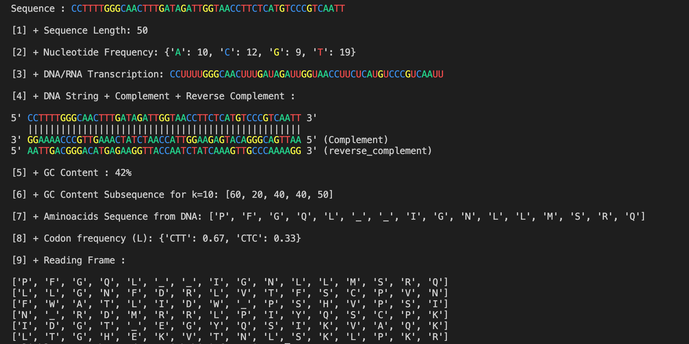

DNA ToolKit
---

This project is a toolkit that allows you to generate randomized sequences of DNA of various lenght and analyze the content of the sequence.

It also contains functions that can transcript the sequence of DNA to RNA and finally translate it into the corresponding amino acid.

Here is a caption of what it might looks like on the terminal:

Content of the project
----
- _DNAToolKit.py_: contains all the important methods of the project
- _Structures.py_: a library of all the existing nucleotids of DNA and RNA as well as the corresponding codons.
- _main.py_: the program to run
- _utilities.py_: color the nucleotids on the terminal
- _screenshots_: folder containing captions of the projects.
